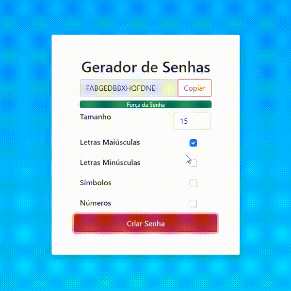

<h1 align="center">Gerador de senhas</h1>

### [Ver projeto funcionando!](https://davilimabr.github.io/safe-password-generator)

 

## 🔖 Sobre
Aplicação que gera senhas aleatórias de acordo com parâmetros específicados pelo usuario. 
## 🛠 Funcionalidades
- Possibilita a criação de senhas aleatórias especificando o número de caracteres e a presença de letras maiúsculas, letras minúsculas, símbolos e números.
- Utiliza do repositório [zxcvbn](https://github.com/dropbox/zxcvbn) para mostrar uma barra de força da senha.
## 🚀 Tecnologias
### Linguagens
- JavaScript;
- HTML;
- CSS.
### Dependências
- [zxcvbn](https://github.com/dropbox/zxcvbn);
- [jQuery](https://jquery.com);
- [Bootstrap](https://getbootstrap.com).
